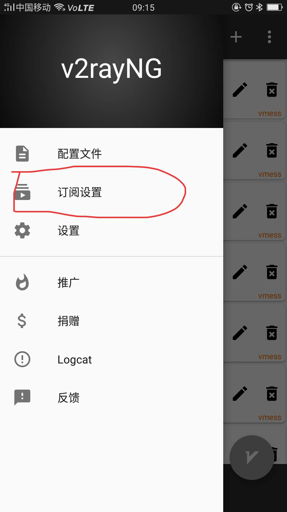
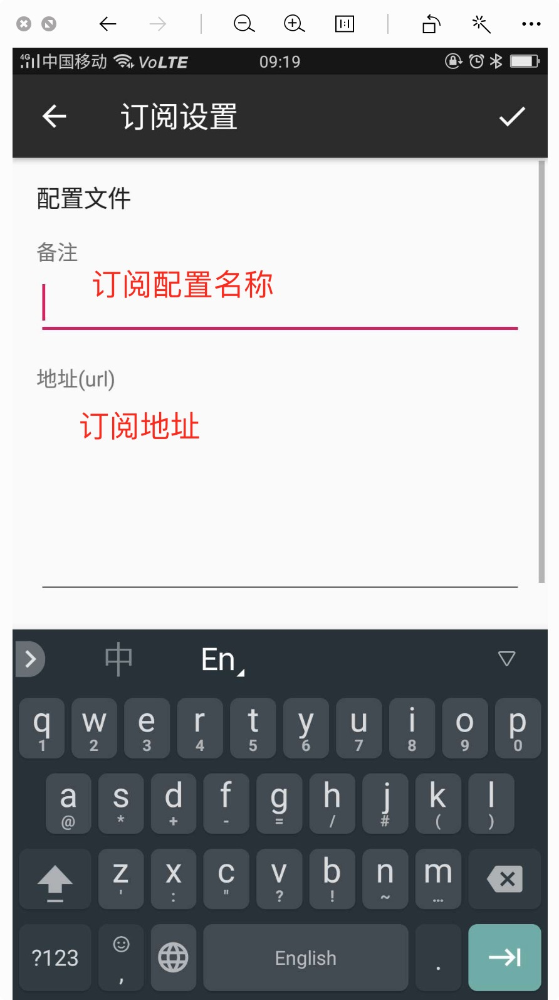
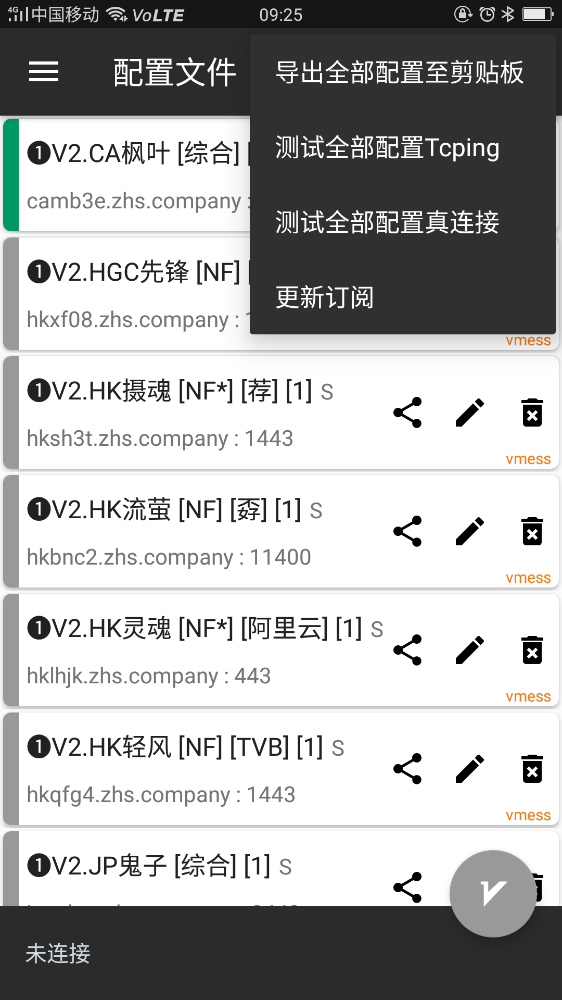
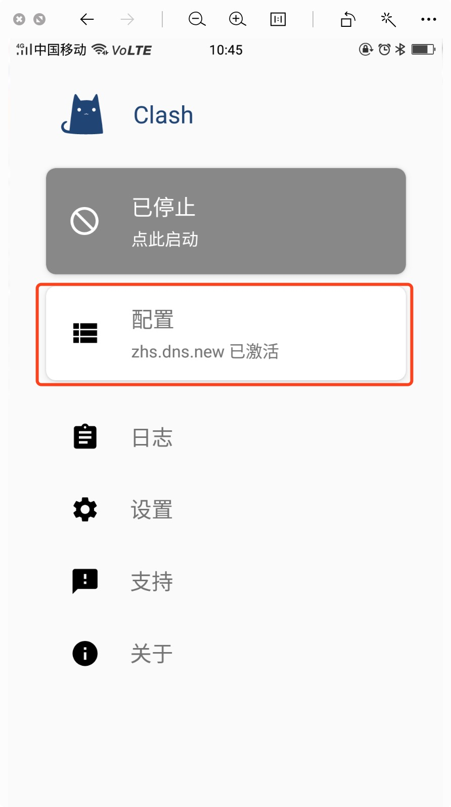
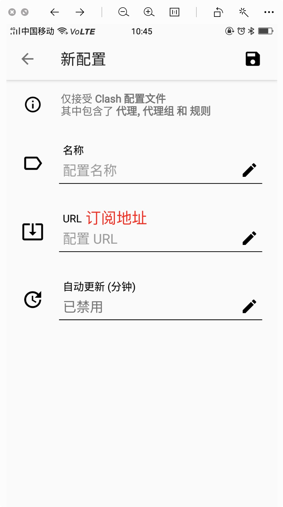
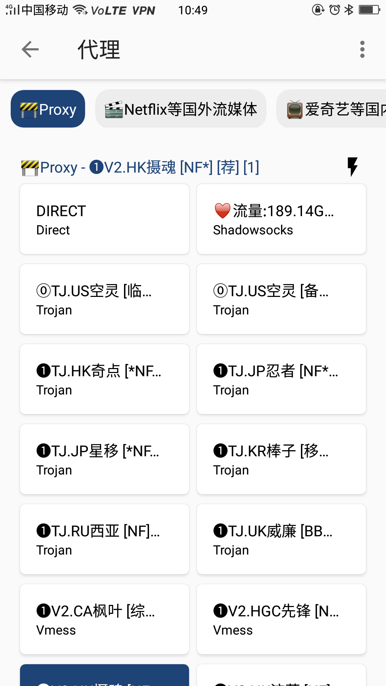

# v2ray android cliet config

## config for v2rayNG

### step.1 下载v2rayNG

[v2rayNG点击下载](https://github.com/2dust/v2rayNG/releases/download/1.2.5/v2rayNG_1.2.5.apk)

### step.2 添加订阅地址

  1. 设置->订阅设置

  

  2. 添加订阅: `https://zhs.futbol/link/UCzYyUF1G2iepskW?mu=2`

  

### step.3 点击主界面右上角，更新订阅

## config for clash

### step.1 下载clash for android

  [clashforandroid点击下载](https://github.com/Kr328/ClashForAndroid/releases/download/v1.2.15/app-universal-release.apk)

### step.2 添加订阅： `https://zhs.futbol/link/jiYv6smw3zCLMjIw?is_ss=3&dns=1`

  1. 添加配置

  

  

  2. 点击启动->更新订阅->选择节点

  
