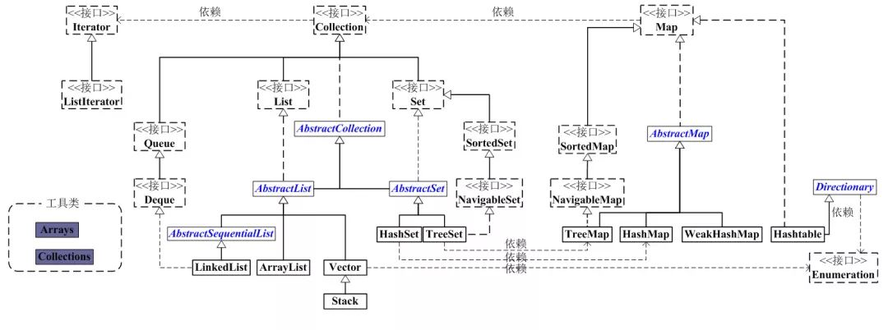

# Java 集合

## 集合分类

### 按实现分类

#### 集合接口

`Collection` 接口是一组允许重复的对象。`Set` 接口继承了 `Collection` 接口，集合元素不重复。`List` 接口继承 `Collection` ，允许重复，维护元素插入顺序。`Map` 接口是键->值对象，与 `Collection` 接口没什么关系。

- Iterator
- LinkIterator
- Collection
- List
- Set
- Queue
- Map

#### 集合抽象类

- AbstractCollection
- AbstractList
- AbstractSet
- AbstractMap
- AbstractSequentialList

#### 集合实现类

- Vector
- Stack
- ArrayList
- LinkedList
- HashSet
- LinkedHashSet
- TreeSet
- HashMap
- LinkedHashMap
- WeakHashMap
- HashTable
- TreeMap
- IdentityHashMap

### 按存储分类

#### List

`List` 集合是有序集合，集合中的元素可以重复，访问集合中的元素可以根据元素的索引来访问

#### Set

`Set` 集合是无序集合，集合中的元素不可以重复，访问集合中的元素只能根据元素本身来访问（这就是为什么集合元素不能重复）

#### Map

`Map` 集合中保存 `Key -> Value` 对形式的元素，访问时只能根据元素的 `Key` 来访问

### List

#### Arrayist & LinkedList

`ArrayList` 和 `LinkedList` 都实现了 `List` 接口

`ArrayList` 是线性表，底层是使用数组实现，在尾端插入和访问数据时效率较高

`LinkedList` 是双向离岸表，在中间插入或者头部插入时效率较高，在访问数据是效率较低

### Set

## Map
