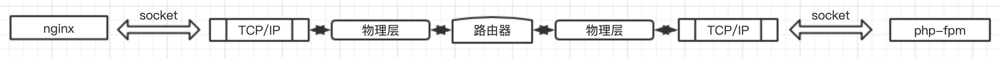

# nginx 和 php-fpm 进程间通信

Nginx 和 PHP-FPM 的进程通信有两种方式，一种是 `TCP Socket`，一种是 `UNIX Domain Socket`。`TCP Socket` 是 **IP:PORT**，nginx 默认的通信方式，可以跨服务器，非常适合做负载均衡。而 `UNIX Domain Socket` 是发生在系统内核里而不经过网络，只能用于 nginx 和 PHP-FPM 都在同一台服务器的场景。

## 进程通信流程

### `UNIX Domain Socket`

  

### `TCP Socket`

- 本地回环（nginx和php-fpm部署在同一台服务器）

  

- 网络通信（nginx和php-fpm部署在不同的服务器）

  

### **MySQL** 命令行客户端链接 **mysqld** 服务也类似有两种方式

- unix socket (default)

  ```bash
  mysql -uroot -p --protocol=socket --socket=/tmp/mysql.sock
  ```

- tcp socket

  ```bash
  mysql -uroot -p --protocol=tcp --host=127.0.0.1 --port=3306
  ```

## 关于性能的讨论

当访问压力较小时（每秒并发不超过1W），`Unix Domain Scoket` 和 `TCP Socket` 在性能上没有显著的差异。

当高并发时，`TCP Socket` 能表现出更高的稳定性，且性能优于 `Unix Socket`，这时还表现出架构上的可扩容负载均衡的优越性；缺点是会占用大量的临时端口，需要配合 **linux** 内核参数调优
