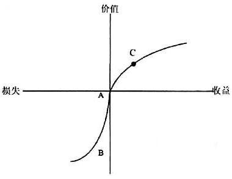

# 关于沉没成本

## 什么是沉没成本

沉没成本（英语：Sunk Cost），或称沉淀成本或既定成本，是经济学和商业决策制定过程中，会用到的概念，代指已经付出且不可收回的成本。

沉没成本常用来和可变成本（Prospective Costs）作比较，可变成本可以被改变，而沉没成本则不能被改变。在微观经济学理论中，做决策时仅需要考虑可变成本。如果同时考虑到沉没成本（这被微观经济学理论认为是错误的），那结论就不是纯粹基于事物的价值作出的。

大多数经济学家们认为，如果人是理性的，那就不该在做决策时考虑沉没成本。

## 沉没成本效应

沉没成本效应（Sunk Cost Effects）。反映出一种”避免浪费的愿望“，尽管很多解释背后都由不同的动机和心理过程所驱使，却都有一个共同的特征--顾及过去的成本和利益。这些解释认为决策者会追究成本投入的有害性并对其进行评估，进而将它和收益联系在一起。

## 沉没成本效应的解释

### 1. 用`前景理论`对沉没成本进行解释

前景理论是关于风险决策的一种描述性模型。它的一个主要特征是人们并不根据最终资产而是根据一个参照点对选择进行评估。如果一个选择的结果在参照点之上，这个选择就被编码为盈利；相反在参照点之下，选择的结果就被认为是损失（见下图）。因为边际价值递减，价值函数对盈利来说是凹的，而对损失则是凸的。价值函数的这种S形状表明人们在盈利条件下通常是风险厌恶的，而在损失条件下是风险寻求的。价值函数的另一个特征是它对损失比对盈利更陡峭。这意味着损失显得比盈利更突出。例如100美元盈利的压力要比100美元损失的压力小很多。参照点通常与现有资产相关，即与现状有关。然而，Kahneman和Tversky指出“一些情形下，人们对损失和盈利的编码与不同于现状的期望或渴望水平有关”。

前景理论对沉没成本效应的解释意味着以前的投资没有被全部折现。在这些事例中，人们的期望不是从现状开始（图1的A点），而是从价值函数损失的一侧开始（图1的B点）。根据这一解释，以前的投资被看作是损失，当决策者评估下一次的行为时仍存在于决策者的大脑中。因为价值函数对损失来说是凸的，进一步的损失不会引起价值的更大规模减少。相反，从B点可以看出，盈利会引起价值的大规模增加。希望有好的结果（也可能使损失进一步增加）而向沉没成本增加资金，这种有风险的再投资比完全撤出投资（会导致肯定的损失）更有可能发生。

### 2. 沉没成本效应的理性原因

沉没成本效应的存在有其理性的一面。通常来说，人们顾及沉没成本的原因是他们不想表现得太浪费。抵制浪费的原则通常是一种好原则。但是这种提法也不是绝对正确的，在一些情形下（例如：剩余资源可以被更有效使用的情形）这种原则可能被过度概括化了。

人们继续执行一项失败计划的一个原因是为了**教育**他自己下次制定决策前要认真考虑。这种愿意是具有潜在理性的。可是它暗示决策者有双重自我的身份，一重是教育者，另一重是接受者。一些决策理论家把决策者刻画为有**多重自我**。例如，Thaler和Shefrin的自我控制理论。他们认为决策者由只受短期结果影响的“近视执行者”和受终身效用影响的“远视计划者”构成。当计划者劝说执行者根据长期目标实施行动，就达到了自我控制。

从这个意义来看，沉没成本行为可能是理性的。我们认为继续一项不成功的计划是一种**特殊有效的吸取教训的方式**，因为人们初始决策的后果可以产生比仅仅指出决策是失败的更好的反馈效果，换句话说就是从**失败中吸取教训**。

二个执行失败计划的原因是把忍受失败的结果作为制定**失误决策的惩罚**。惩罚减少了决策者在未来犯同样错误的可能性；因此它具有给决策者一个教训的功能。与吸取教训原因一样，这一原因也暗含了决策者是由教育者和接受者构成的。但是，两者不一致的是它在做出惩罚时没有明确为什么惩罚是必要的（除了决策者值得受惩罚）。因此，如果**惩罚能够阻止未来的不良决策**，那么惩罚就是对关注沉没成本的一种理性解释；而如果它只是提供报复，那么它就是非理性的。基于这样的观点，为了吸取教训而继续执行计划在改变决策者行为方面比为了惩罚自己而继续执行计划更为有效。

最后一个原因是为了展现一个**良好的前后一致的决策者形象**。改变行动计划常被认为是由于决策失误，这等于承认了错误。与此相反，保持一致常能得到别人的尊敬。继续执行一项已经在运作的计划也能使一个人认为自己是一个好的决策者，也就是受自我**肯定的动机的驱动**。因为一个良好的自我表现具有很高的主观价值，这种原因也可以被看作是理性的。

研究者为沉没成本效应提供了很多合理而具有普遍性的解释，这些解释使我们能够更加理性地对待沉没成本，避免出现沉没成本效应。然而，沉没成本并不总是导致后期投入的增加，相反，一些投资者和决策者“矫枉过正”，行为上出现了沉没成本的逆效应。

## 影响沉没成本效应的主要因素

### 1. 后悔和沉没成本效应

在经济学中,**后悔是损失的情绪和感觉**,它的出现往往是因为“事后发觉不同的决策(例如,终止一项处于损失状态的冒险)会有更好的结果”。如果损失是决策者自己造成的,后悔的程度可能进一步增加。为了使**后悔最小化**,决策者必须考虑未来的状况,并对可能会出现的**最好结果和实际结果进行比较**。如果这种比较显示坚持下去会招致比以往更大的损失,那么潜在的后悔是显而易见的,因此决策出现的倾向性可能是承担今天的损失而不是去冒明天自责的风险,决策者会舍弃沉没成本而做出退出交易的行为。

在实际生活中,人们有可能**预知一些有关决策后果的信息**。决策之后的后悔可能已被决策者预期到了,并且在制定决策时考虑到了。因此,风险承担行为与后悔预期有关。在反馈结果缺乏的条件下,**选择安全性方案最小化了体验后悔的可能性**;而在反馈结果存在条件下,如果风险性方案能导致更好的结果,选择安全性方案就可能会导致后悔。因此在反馈存在条件下,选择安全性方案时可能产生的后悔将更加痛苦;选择风险性方案的倾向性则沉没成本中的心理学问题更加强烈。

### 2. 心理账户

心理账户是一种**自我控制措施**,如果在最后期限或达到了投资限制(比如,“给它12个月的时间”或“在100美元那停止”)时没有获得结果,通常人们会在心理上为退出一项冒险预先制定预算并采取行动。这些心理预算的确切数额是很武断的,并且没有任何规范性原则。例如,股票交易者使用自动的停止命令(比如,“股价下跌10%就卖掉”)作为一种工具来保护他们,消除他们抱着反转的希望而呆得太久的心理倾向对他们的影响。从狭义经济理论的角度看,这些自我设置的停止规则并非为了刻意表现出理性。相反,它们构成了**对内在非理性的承认**。

在支持了以往有关沉没成本的研究结论的基础上,Heath提出了沉没成本效应可能不像人们相信的那样无所不在。他发现沉没成本效应的强度不是一成不变的,相反决定于以前没有发现的两个因素。具体分为两种情况:当决策者**没有“心理预算”(支出限制)或者没有记录累计跟踪时,他们很可能被沉没成本所俘获,产生沉没成本效应,即倾向于增加投入;相反,当决策者建立“心理预算”并能够进行跟踪时,沉没成本效应就会减弱,乃至不再发生**。

### 3. 初始投资

一种明显的猜测认为初始投资越大,沉没成本效应越强;例如,如果购买大提琴的费用为1000美元而不是100美元或免费,那个人更有可能选择继续参加大提琴课程。实验性证据支持这一猜测,Garland和Newport发现与**个人总可用资源数量相关的相对成本比初始投资的绝对数量更重要**。这种相对成本的重要性与期望理论一致,即如果终止参加高额学费的课程,未来损失(继续参加课程所带来的不愉快)会导致主观价值减少得较少,而同时已经发生的损失(也就是大提琴和课程的费用)数量增加。

### 4. 情境性因素

还存在情境性因素比如**决策者的个人责任等影响沉没成本效应**。例如,Whyte指出如果决策者感到要为初始计划和行动产生的不良结果负责任,沉没成本行为就会更经常地发生。相反,Simonson和Nye发现人们要承担的决策责任减少了导致沉没成本效应倾向性。Simonson和Nye的结果很可能受他使用经济专业的学生做实验的影响,这些学生中有很多人受过如何避免沉没成本效应的正式教育。最后,Arkes & Blumer发现**沉没成本行为和是否是个人或为第三方制定决策之间不存在一致的关系**。这些研究表明个人参与对行为的影响在一些情形中还不清楚。

## 沉没成本的逆效应

沉没成本导致了**风险厌恶**，这种由沉没成本可能引起的风险厌恶称为“沉没成本的逆效应”。Simon指出：有些时候，如果选择超过了人们的渴望水平，人们就会通过把它们编码为“满意”来简化这些选择；如果选择低于渴望水平，人们就会把它编码为“不满意”来简化这些选择。**一定水平的渴望通过风险规避性选择就可以得到满足**。

用下面的例子来进行解释：某个体面临两个选择：一个是选择安全地拿到50美元，另一个风险性选择的结果可能更好（拿到100美元）也可能更坏（拿到0美元）。假设50美元等于这个人所期待的，也就是等于这个人的渴望水平。如果这一渴望水平被看作参照点（从C点开始画一条新曲线，A点在损失区域，见图1），那么安全性选择就是满意的。更大的盈利只能导致价值适度的增加。既然现在的资产点（图1中的点A）被看作是损失，并且损失比盈利更突出，那么安全的选择就比风险性选择更有吸引力。即使在风险性选择中“获胜”得到更好的结果，但那是不确定，而安全性选择却可始终满足渴望水平。因此**有时沉没成本可能会促进风险规避行为**。

**沉没成本的逆效应可能会导致一些投资者过于轻易地放弃一项失败的或正在进行的决策**，这可能与**沉没成本的超敏性**有关。沉没成本的超敏性是指：**以前的损失能使决策者对未来的损失很敏感**。这或许能解释这样的现象，即投资年限较长的投资者，在继续进行经济活动时，为避免重犯同样错误预期的痛苦，倾向于不再继续维持投资的状态，并强迫自己立即结束投资。

Heath也发现那些**建立心理帐户的投资者可能会不成熟地退出**。当对人们一个项目的累积投资达到了帐户限制时，即使任何理性的经济（边际的）分析都认为应该继续和增加投资，人们依然会减少对这个项目的心理责任感并会拒绝进一步的投资，甚至导致投资者的退出（例如，卖掉一个资本投资项目）。**原因仅仅是因为总投资超出了人们当初的预算额**。这一效应也能解释为何正在遭受损失的决策者，会在低于合理价格的情况下卖掉他的投资。因为此时，在他**花完了他所有的心理预算**后，决策者不得不带着他能拿到的东西义无反顾地退出，同时他也拒绝为收回已经发生的损失而冒更大的风险或导致全部损失的诱惑。

ps: 摘自 [wikipedia](https://wiki.mbalib.com/wiki/%E6%B2%89%E6%B2%A1%E6%88%90%E6%9C%AC%E6%95%88%E5%BA%94) | [MBA智库](https://zh.wikipedia.org/wiki/%E6%B2%89%E6%B2%A1%E6%88%90%E6%9C%AC)
