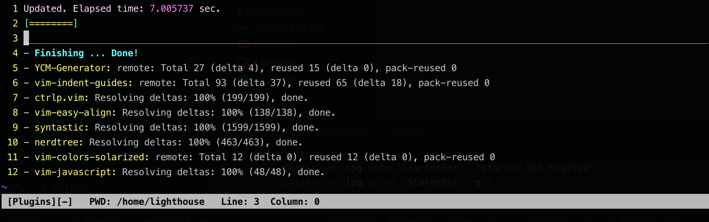

# 解决 vimPlug 安装插件失败

## 问题表现

- PlugInstall 安装执行缓慢
- PlugInstall 安装插件失败

## 解决方案

1. 将 `let fmt = get(g:, 'plug_url_format', 'https://git::@github.com/%s.git')` 改为 `let fmt = get(g:, 'plug_url_format', 'https://git::@hub.fastgit.org/%s.git')`

2. 将改行`'^https://git::@github\.com', 'https://github.com', '')` 改为 `'^https://git::@hub.fastgit\.org', 'https://hub.fastgit.org', '')`

本质上是将github.com的访问替换为代理服务器，加快下载速度

## 结果测试

